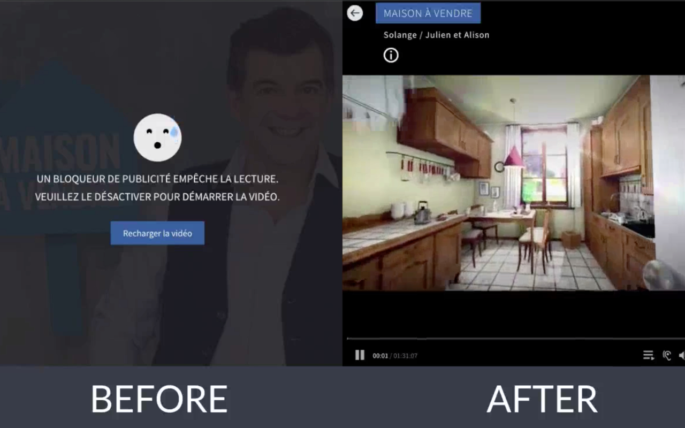

# 👈🏻🚫 No AdBlock-Killer

> Have you ever had to disable adblock on a website? Thanks to **no-adblock-killer**, keep enjoying the **ad-free** website!

[](https://www.youtube.com/watch?time_continue=2&v=tZyNCz8wsdk)

## 🎉 Instalation Is So Easy !
[ **Chrome Extension**]()
<br>
<br>

## 🎛 How does it works ?
> **Adblock-killers** are located in website source code, each using a different means to detect them.

**This extension** simply modifies a small part of the source code **(1-10 chars)** where the adblock **is** detected.

---

*There is also [more options](#configuration) avaibles to disable adblock-killer.*

*Check the [config.json](static/config.json) or `npm run config:display` to see what's changing on which website.*
<br>
<br>


## ✅ Tests
```bash
npm test
```
```
🗑  Clearing
📝 Building scripts
🈺 Minifying configuration
✅ 'config.min.json' file is now minfified.
📎 Building extension
🕑 Testing


  #CONFIG
    ✓ should read config
    ✓ should have correct config file
    ✓ should get the initial script (719ms)
    ✓ should read the replaced script
    ✓ should have unique name
    ✓ should have correct differences
    ✓ should have correct chrome pattern


  7 passing (744ms)
```
<br>

## ⌨️ Usefull Commands
|Name|Command|Description|
|:-:|:-:|:-:|
|start|`npm start`|Start the construction in watch mode. Any changes on [src/](src/) will automatically rebuild the extension.<br>**🔧 development mode**|
|build|`npm run build`|Build the project.<br>**📦 production mode**|
|config|`npm run build:config`|Build the [config.json](static/config.json). <br>**This is not an automated task, so if you edit [config.json](static/config.json) please run it.**|
|display|`npm run config:display`|Display the [config.build.json](static/config.build.json) user-friendly.|
<br>

## 👀 Quick View Of The Architecture
|Path|Description|
|:-:|:-:|
|***dist/***|📝 Where [scripts](src/scripts) are built and ready to run.|
|***app/***|🖥 The built chrome extension.|
|***static/config.json***|💾 Where **actions** of each site are written.<br>[See here ](static/config.json) to know how it's written.|
| ***static/config.build.json***|The built config of [config.json](static/config.json).<br>**⛔️ Don't edit it, it'll be updated automatically.**|
<br>

## 🌈 Contributor Friendly
### How Can I Contribute ? *(my advice 😇)*
1️⃣ **Find the file where is written *"the adblock killer"*.**<br>
> I usualy use **chrome devtools/networks** and simply search for something likes **"adblock"** in javascript sources.

2️⃣ **Then find the specific *"code instruction"* that spot your adblock.**
> For example for *tf1.fr*, I found this line that informs the website (if `"e == true"`), that user has an extension adblock by debugging the javascript code.
> ```javascript
> this.adblockIsActivated(function(e){if(e) //...
> ```
> By modifying the variable `e` to `false`, I disable the adblock killer.

3️⃣ **Write Your *[configuration]()*.**
> I write a [RegExp](https://developer.mozilla.org/en-US/docs/Web/JavaScript/Reference/Global_Objects/RegExp) that can replace that instruction: <br>
> `/this\.adblockIsActivated\(function\((\w+)\)\{if\(\w\)/` <br>
> &nbsp; &nbsp; *(Written as: `{"from": "this\\.adblockIsActivated\\(function\\((\\w+)\\)\\{if\\(\\w\\)"}` in the [config.json](static/config.json))* <br><br>
> I write the replaced content: <br>
> `"this.adblockIsActivated(function($1){if(false)"` <br>
> &nbsp; &nbsp; *(Written as: `{"to": "this.adblockIsActivated(function($1){if(false)"}` in the [config.json](static/config.json))* <br><br>
> *Note: Use the [RegExp Block](https://developer.mozilla.org/en-US/docs/Web/JavaScript/Guide/Regular_Expressions#Using_parenthesized_substring_matches_2) to match any variable name. Variable name can be changes during minor patch by the website owner. Eg. `function(e)` can became `function(a)` in a different webpack build.*

4️⃣ **Try Your Fix.**
> I update the [config.json](static/config.json) by respecting [this template]().<br>
> I `npm run build:config` to build a new [config.build.json](static/config.build.json).<br>
> I `npm start` to build the extension.<br>
> Finaly I [load the builded extension](https://developer.chrome.com/extensions/getstarted#manifest) to test it in my browser.

5️⃣ **Make Your PR 🙂**
> **[Fork](https://github.com/login?return_to=%2Flucasmrdt%2Fno-adb-killer)** the repository if isn't yet done. <br>
> Push your contributions. And wait feedback ! 🎉 <br>

<br>

## <a id="configuration"></a>📃 Configuration [(config.json)](static/config.json)
> The [config.json](static/config.json) contains an array of configuration.
### Configuration Template
|Key|Type|Value|Example|Description|
|:-:|:-:|:-:|:-:|:-:|
|**action**|`string`|[`"replace"`](#configuration-replace)<br>[`"redirect"`](#todo-redirect-cancel)<br>[`"cancel"`](#todo-redirect-cancel)|`"replace"`|The action of your configuration.
|**name**|`string`|`any`|`"6play"`|The website name.
|**pattern**|`string`|`any`|`"https://www.6play.fr/player-fw-*"`|The [Chrome Pattern URL](https://developer.chrome.com/apps/match_patterns).
|**url**|`string`|`any`|`"https://www.6play.fr/player-fw-d18b7b5d33.bundle.js"`|The URL of the adblock killer script.

### <a id="configuration-replace"></a>Replace Configuration
|Key|Type|Example|Description|
|:-:|:-:|:-:|:-:|
|**from**|`string (RegExp)`|`"this\\.adblockIsActivated\\(function\\((\\w+)\\)\\{if\\(\\w+\\)"`|The excaped RegExp of the instruction to be replace.
|**to**|`string`|`"this.adblockIsActivated(function($1){if(false)"`|The replaced string to disable the adblock killer.


## ⚠️ Any Issue ? Find a website with an adblock killer ?
> Go **[HERE](https://github.com/lucasmrdt/no-adb-killer/issues)** and explain me what's wrong. 🤙🏻


## ✅ Todo
- [ ] <a id="todo-redirect-cancel"></a>Add Redirect and Cancel action documentation.

****
